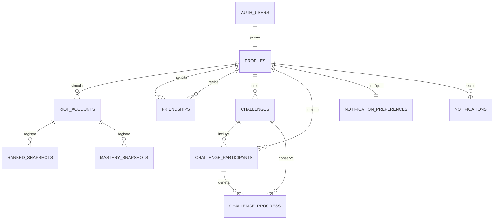

# Modelo de datos

## Objetivo

Este documento define el modelo relacional inicial de LeagueOfFriends. Todavía no crea tablas ni conecta un proyecto de Supabase; establece el contrato que deberá respetar la primera migración.

El modelo debe permitir:

- autenticar usuarios y mantener un perfil público separado de `auth.users`;
- vincular uno o varios Riot IDs mediante su PUUID;
- establecer amistades privadas;
- crear retos con distintos objetivos y participantes;
- conservar snapshots históricos de rango, victorias y maestría;
- calcular clasificaciones sin depender de consultar a Riot en tiempo real;
- registrar avisos dentro de la aplicación y futuros correos automáticos.

## Decisiones principales

- PostgreSQL será la fuente de verdad y Supabase Auth administrará las identidades.
- Todas las tablas de la aplicación usarán nombres `snake_case` en minúsculas.
- Los identificadores internos usarán `bigint generated always as identity`, excepto `profiles.id`, que compartirá el UUID de `auth.users`.
- Los datos de Riot se identificarán por `puuid`. El Riot ID, compuesto por `game_name` y `tag_line`, será información visible y actualizable, no la identidad primaria.
- Las fechas se almacenarán como `timestamptz` y siempre se interpretarán en UTC.
- Los estados se representarán con `text` y restricciones `check`, evitando enums difíciles de modificar durante esta etapa.
- Toda tabla expuesta mediante la Data API tendrá RLS activado y permisos explícitos por rol.
- Las claves secretas de Riot, Supabase y el proveedor de correo nunca se almacenarán en estas tablas ni se enviarán al navegador.

## Relación entre entidades

## Tablas públicas

### `profiles`

Extiende la identidad administrada por Supabase Auth sin exponer el esquema `auth`.

| Columna | Tipo | Regla |
| --- | --- | --- |
| `id` | `uuid` | PK y FK a `auth.users(id)` con borrado en cascada |
| `display_name` | `text` | Obligatorio, entre 2 y 32 caracteres |
| `avatar_url` | `text` | Opcional |
| `timezone` | `text` | Obligatorio, valor IANA; por defecto `UTC` |
| `created_at` | `timestamptz` | Obligatorio, por defecto `now()` |
| `updated_at` | `timestamptz` | Obligatorio, por defecto `now()` |

El correo permanece en Supabase Auth y no se duplica en `profiles`.

### `riot_accounts`

Representa una cuenta de League of Legends vinculada a un perfil.

| Columna | Tipo | Regla |
| --- | --- | --- |
| `id` | `bigint identity` | PK |
| `profile_id` | `uuid` | FK a `profiles(id)` |
| `puuid` | `text` | Obligatorio y único |
| `summoner_id` | `text` | Opcional; identificador cifrado devuelto por League API |
| `game_name` | `text` | Obligatorio, parte visible del Riot ID |
| `tag_line` | `text` | Obligatorio, parte visible del Riot ID |
| `platform_route` | `text` | Obligatorio, por ejemplo `la1` |
| `regional_route` | `text` | Obligatorio, por ejemplo `americas` |
| `is_primary` | `boolean` | Obligatorio, por defecto `false` |
| `verified_at` | `timestamptz` | Momento en que Riot confirmó la cuenta |
| `last_synced_at` | `timestamptz` | Última sincronización correcta |
| `sync_status` | `text` | `pending`, `ready`, `stale` o `failed` |
| `created_at` | `timestamptz` | Obligatorio, por defecto `now()` |

Restricciones adicionales:

- un perfil solo puede tener una cuenta principal;
- la combinación normalizada de `game_name`, `tag_line` y ruta no sustituye la unicidad del PUUID;
- los campos visibles del Riot ID pueden actualizarse cuando Riot devuelva un valor nuevo.

### `friendships`

Conserva una única solicitud entre dos perfiles.

| Columna | Tipo | Regla |
| --- | --- | --- |
| `id` | `bigint identity` | PK |
| `requester_id` | `uuid` | FK a `profiles(id)` |
| `addressee_id` | `uuid` | FK a `profiles(id)` |
| `status` | `text` | `pending`, `accepted`, `rejected` o `blocked` |
| `created_at` | `timestamptz` | Obligatorio, por defecto `now()` |
| `responded_at` | `timestamptz` | Opcional |

Debe existir una restricción que impida relacionarse con uno mismo y un índice único sobre la pareja ordenada de usuarios para evitar solicitudes duplicadas en sentido inverso.

### `challenges`

Define la configuración y el ciclo de vida de un reto.

| Columna | Tipo | Regla |
| --- | --- | --- |
| `id` | `bigint identity` | PK |
| `creator_id` | `uuid` | FK a `profiles(id)` |
| `name` | `text` | Obligatorio, entre 3 y 48 caracteres |
| `metric` | `text` | `lp_gain`, `target_rank`, `wins` o `mastery_gain` |
| `status` | `text` | `draft`, `inviting`, `active`, `completed` o `cancelled` |
| `queue_type` | `text` | Por defecto `ranked_solo_5x5` |
| `target_value` | `integer` | Meta numérica para LP, victorias o maestría |
| `target_tier` | `text` | Meta opcional para retos de rango |
| `target_division` | `text` | División opcional de la meta de rango |
| `starts_at` | `timestamptz` | Inicio del seguimiento |
| `ends_at` | `timestamptz` | Fin del seguimiento; debe ser posterior al inicio |
| `winner_profile_id` | `uuid` | FK opcional a `profiles(id)` |
| `rules` | `jsonb` | Solo reglas extensibles que no merezcan una columna estable |
| `created_at` | `timestamptz` | Obligatorio, por defecto `now()` |
| `updated_at` | `timestamptz` | Obligatorio, por defecto `now()` |

Un reto no se activa hasta que exista al menos un rival aceptado y todos los participantes tengan una cuenta de Riot válida.

### `challenge_participants`

Une perfiles y retos, además de congelar la línea base de cada jugador.

| Columna | Tipo | Regla |
| --- | --- | --- |
| `challenge_id` | `bigint` | FK a `challenges(id)` |
| `profile_id` | `uuid` | FK a `profiles(id)` |
| `riot_account_id` | `bigint` | FK a `riot_accounts(id)` |
| `role` | `text` | `creator` o `participant` |
| `status` | `text` | `invited`, `accepted`, `declined` o `removed` |
| `baseline_value` | `integer` | Valor inicial normalizado para la métrica elegida |
| `current_value` | `integer` | Último valor normalizado |
| `joined_at` | `timestamptz` | Momento de aceptación |
| `updated_at` | `timestamptz` | Último cálculo de progreso |

La PK será compuesta por `challenge_id` y `profile_id`. Una cuenta de Riot no puede representar a dos participantes distintos dentro del mismo reto.

### `ranked_snapshots`

Conserva el historial general usado por el dashboard y los retos clasificatorios.

| Columna | Tipo | Regla |
| --- | --- | --- |
| `id` | `bigint identity` | PK |
| `riot_account_id` | `bigint` | FK a `riot_accounts(id)` |
| `queue_type` | `text` | Cola consultada |
| `tier` | `text` | Rango devuelto por Riot |
| `division` | `text` | División del rango |
| `league_points` | `integer` | Entre 0 y 100 cuando aplique |
| `wins` | `integer` | No negativo |
| `losses` | `integer` | No negativo |
| `captured_at` | `timestamptz` | Momento de captura |

La combinación `riot_account_id`, `queue_type` y `captured_at` será única.

### `mastery_snapshots`

Permite retos futuros sobre el progreso de campeones sin mezclarlo con el rango.

| Columna | Tipo | Regla |
| --- | --- | --- |
| `id` | `bigint identity` | PK |
| `riot_account_id` | `bigint` | FK a `riot_accounts(id)` |
| `champion_id` | `integer` | Identificador oficial del campeón |
| `mastery_level` | `smallint` | Nivel de maestría no negativo |
| `mastery_points` | `bigint` | Puntos no negativos |
| `captured_at` | `timestamptz` | Momento de captura |

La combinación `riot_account_id`, `champion_id` y `captured_at` será única.

### `challenge_progress`

Materializa la clasificación histórica de un reto para evitar recalcular todos los snapshots en cada visita.

| Columna | Tipo | Regla |
| --- | --- | --- |
| `id` | `bigint identity` | PK |
| `challenge_id` | `bigint` | FK a `challenges(id)` |
| `profile_id` | `uuid` | Participante del reto |
| `metric_value` | `integer` | Valor absoluto usado para el cálculo |
| `progress_value` | `integer` | Diferencia respecto a la línea base |
| `position` | `smallint` | Posición calculada, mayor que cero |
| `captured_at` | `timestamptz` | Momento del cálculo |

La FK compuesta `challenge_id`, `profile_id` debe apuntar a `challenge_participants`.

### `notification_preferences`

| Columna | Tipo | Regla |
| --- | --- | --- |
| `profile_id` | `uuid` | PK y FK a `profiles(id)` |
| `email_enabled` | `boolean` | Por defecto `true` |
| `overtaken_enabled` | `boolean` | Por defecto `true` |
| `challenge_updates_enabled` | `boolean` | Por defecto `true` |
| `digest_frequency` | `text` | `instant`, `daily` o `weekly` |
| `updated_at` | `timestamptz` | Obligatorio, por defecto `now()` |

### `notifications`

Registra avisos visibles y el estado del envío de correo, permitiendo idempotencia.

| Columna | Tipo | Regla |
| --- | --- | --- |
| `id` | `bigint identity` | PK |
| `profile_id` | `uuid` | FK a `profiles(id)` |
| `challenge_id` | `bigint` | FK opcional a `challenges(id)` |
| `type` | `text` | `overtaken`, `invitation`, `challenge_started`, `challenge_ended` |
| `deduplication_key` | `text` | Única; impide enviar dos veces el mismo evento |
| `payload` | `jsonb` | Datos necesarios para representar el aviso |
| `read_at` | `timestamptz` | Opcional |
| `email_sent_at` | `timestamptz` | Opcional |
| `created_at` | `timestamptz` | Obligatorio, por defecto `now()` |

## Datos privados del servidor

Las operaciones internas se ubicarán en un esquema `private`, no expuesto por la Data API.

### `private.sync_jobs`

Controlará trabajos de sincronización con Riot: cuenta, motivo, número de intentos, siguiente ejecución, bloqueo temporal y último error. Permitirá respetar límites de uso sin realizar peticiones duplicadas.

### `private.email_outbox`

Conservará envíos pendientes y reintentos del proveedor de correo. El cliente nunca tendrá acceso directo a esta tabla.

## Índices previstos

PostgreSQL no crea automáticamente índices para las claves foráneas. La primera migración deberá incluir al menos:

- `riot_accounts(profile_id)` y un índice único parcial para la cuenta principal;
- ambos extremos de `friendships` y su pareja canónica única;
- `challenges(creator_id, status)` y `challenges(status, ends_at)`;
- `challenge_participants(profile_id, status)` y `challenge_participants(riot_account_id)`;
- `ranked_snapshots(riot_account_id, queue_type, captured_at desc)`;
- `mastery_snapshots(riot_account_id, champion_id, captured_at desc)`;
- `challenge_progress(challenge_id, captured_at desc, position)`;
- `notifications(profile_id, read_at, created_at desc)`;
- todas las columnas usadas para comprobar propiedad o participación en políticas RLS.

## Acceso y RLS

| Entidad | Lectura | Escritura desde cliente |
| --- | --- | --- |
| Perfil | Propietario y campos públicos necesarios para amigos | Solo el propietario |
| Cuenta de Riot | Propietario, amigos aceptados y participantes del mismo reto | Solo el propietario; verificación desde servidor |
| Amistad | Solicitante y destinatario | Crear solicitud y responder si participa |
| Reto | Participantes e invitados | Creador durante borrador; acciones limitadas por rol |
| Participante | Miembros del mismo reto | Invitado responde; creador puede retirar antes del inicio |
| Snapshots | Propietario, amigos aceptados y miembros de retos compartidos | Ninguna; solo procesos del servidor |
| Progreso | Participantes del reto | Ninguna; solo procesos del servidor |
| Preferencias | Solo el propietario | Solo el propietario |
| Notificaciones | Solo el destinatario | Marcar como leída; creación desde servidor |

Las políticas usarán `(select auth.uid())` y predicados de propiedad o pertenencia. `to authenticated` por sí solo no será considerado autorización suficiente. Las escrituras servidoras usarán credenciales secretas únicamente en entornos confiables.

## Ciclos principales

### Vincular una cuenta de Riot

1. El usuario introduce `game_name`, `tag_line` y región.
2. El servidor consulta Account API y obtiene el PUUID.
3. El servidor consulta los datos de League correspondientes a la plataforma.
4. Se crea o actualiza `riot_accounts` y se registra el primer snapshot.
5. La interfaz recibe solo el resultado normalizado, nunca la clave de Riot.

### Activar un reto

1. El creador guarda el reto con estado `inviting`.
2. Los rivales aceptan o rechazan su participación.
3. Al iniciar, el servidor captura una línea base para cada participante.
4. El estado cambia a `active` dentro de la misma transacción.
5. Las sincronizaciones posteriores actualizan `current_value` y añaden registros de progreso.

### Avisar que alguien tomó la delantera

1. Una sincronización cambia la primera posición.
2. Se crea una notificación con una `deduplication_key` determinista.
3. Las preferencias deciden si se añade un trabajo al buzón de correo.
4. El proveedor confirma el envío y se registra `email_sent_at`.

## Límites del primer alcance

La primera implementación incluirá perfiles, una cuenta de Riot principal, amistades, retos, participantes, snapshots clasificatorios y preferencias de notificación. Se posponen:

- equipos o comunidades con administración propia;
- recompensas económicas;
- chat dentro de los retos;
- retos públicos de gran escala;
- almacenamiento indefinido de partidas completas;
- múltiples proveedores de correo simultáneos.

## Referencias verificadas

- [Supabase: tablas y relaciones](https://supabase.com/docs/guides/database/tables)
- [Supabase: administración de datos de usuario](https://supabase.com/docs/guides/auth/managing-user-data)
- [Supabase: seguridad mediante RLS](https://supabase.com/docs/guides/database/postgres/row-level-security)
- [Riot Games: transición a Riot ID y PUUID](https://developer.riotgames.com/docs/lol)
- [Riot Games: referencia de APIs](https://developer.riotgames.com/apis/)
